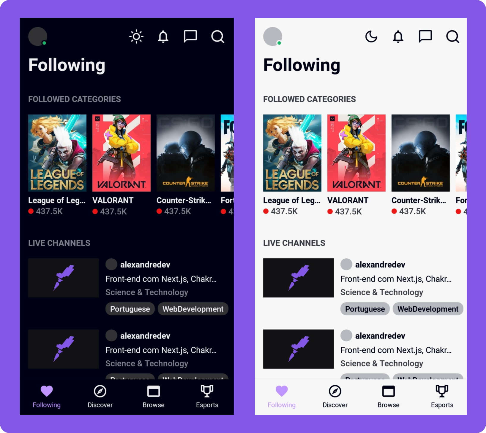

<h1 align="center">
  
  <br />
  <a href="https://www.linkedin.com/in/alexandre-costa-401699199">
    
  </a>
  <br />
  <a href="https://github.com/alexandredev3/proffy/issues">
    
  </a>
  <a href="https://github.com/alexandredev3/proffy/network">
    
  </a>
  <a href="https://github.com/alexandredev3/proffy/stargazers">
    
  </a>
</h1>
<p align="center">
 <a href="#description">Descrição</a> •
 <a href="#design">Design</a> • 
 <a href="#features">Funcionalidades</a> • 
 <a href="#tecnologias">Tecnologias</a> •
 <a href="#install">Instalação</a> •
 <a href="#author">Autor</a> •
</p>
<p align="center" id="description">
  Clone do aplicativo mobile do Twitch Tv.
</p>
<h1 align="center" id="design">
  
</h1>

<h2 id="features">
  Features
</h2>

- [x] Habilitar dark mode. 

<h2 id="tecnologias">
  🛠 Tecnologias
</h2>

 As seguintes ferramentas foram usadas na construção do projeto:

- [Expo](https://expo.io/)
- [React Native](https://reactnative.dev/)
- [TypeScript](https://www.typescriptlang.org/)
- [StyledComponents](https://styled-components.com/)

<h2 id="install">
   📜️ Instalação
</h2>

### Pré-requisitos

Antes de começar, você vai precisar ter instalado em sua máquina as seguintes ferramentas:
[Git](https://git-scm.com), [Expo](https://expo.io/) instalado no seu celular ou emulador.
Além disto é bom ter um editor para trabalhar com o código como [VSCode](https://code.visualstudio.com/)

### 📱️ Rodando o Mobile (aplicativo mobile)

```bash
$ git clone <git@github.com:alexandredev3/twitch-clone.git>

# Vá para a pasta twitch
$ cd twitch

# Instale as dependências
$ yarn

# Execute aplicação
yarn start

# Com esse comando ele vai abrir uma aba no seu navegador com um QR CODE.
# No seu celular(ou emulador) abre o aplicativo chamado Expo, e escaneie o QR CODE.
```

<h2 id="author">
   👷️ Autor
</h2>

<a href="https://github.com/alexandredev3/">
 
 <br />
 <sub><b>Alexandre Costa</b></sub>
</a>


Feito com ❤️ por Alexandre Costa 👋🏽 Entre em contato!🚀

<a href="https://www.linkedin.com/in/alexandre-costa-401699199">
  
</a>
